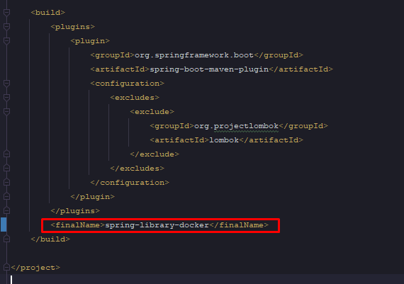
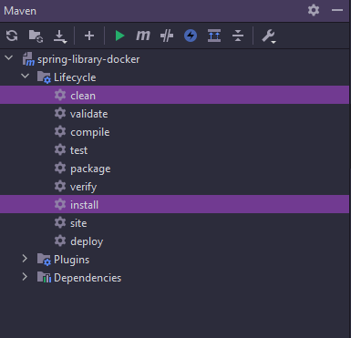
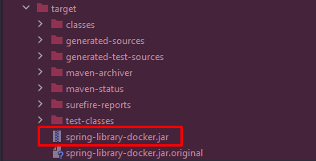
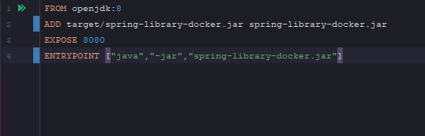
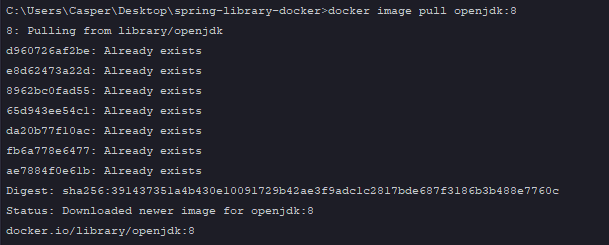
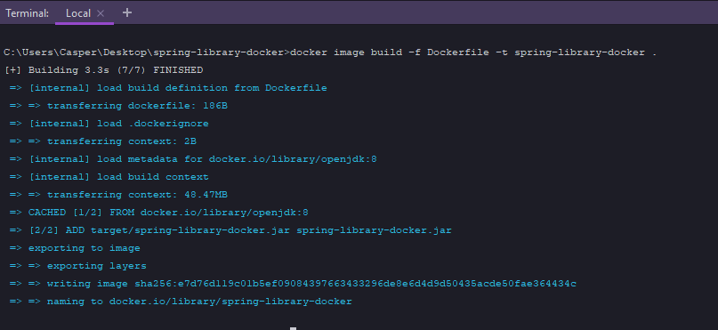
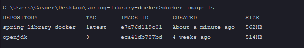
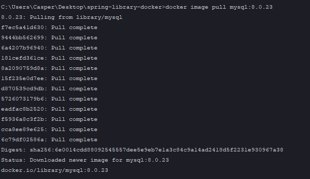
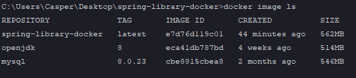

# spring-library-docker

* If you want to run this project on your computer. You should install Docker.
  ! By the way The Docker should run background.
  
* Also you should create *.jar file.(But Jar file name is named in pom.xml file)

  

* Maven --> clean and install

* Jar file check

  
* Dockerfile

  

! **docker image pull openjdk:8**

* And then you should create image of your project. 
  - (docker image build -f Dockerfile -t spring-library-docker) .
  

      
* After create image, you can check. 
    * docker image ls
  

Before the project run in docker stack.I mean, you have to need docker-compose.yml file for project run.
(If you want to use images in the docker-compose.yml file. You should pull or create necessary images for your project before )
! (If you use database, you should pull database image (mysql postresql or anything). Mysql database was used in the this project).
* Mysql version 8.0.23
  * docker image pull mysql:8.0.23
  

* docker image check

* docker-compose-yml

* Docker stack
  * docker stack deploy -c .\docker-compose.yml spring-library-stack

